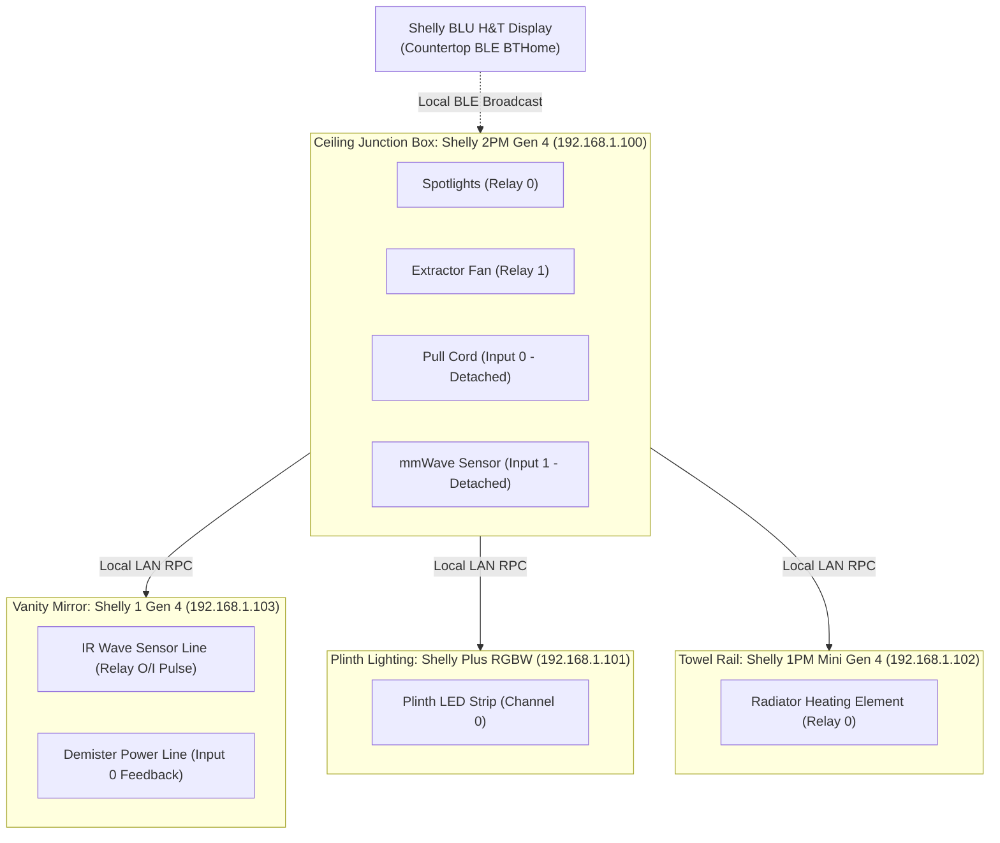

# 💡 shelly-bathroom

 [](LICENSE)

Fully local, multi-device smart bathroom automation running on bare-metal Shelly Gen 4 hardware using mJS. 

No cloud dependency, and no need for another smart hub for day-to-day operation. A key focus has been that if the network goes down, the basic functionality still works.

---

## What It Does

- **Adaptive Humidity Tracking**: Tracks ambient baseline humidity using an Exponential Moving Average (EMA) and triggers on spikes. Freezes the baseline during shower events so lingering steam doesn't trick the fan into shutting off early.
- **Smart Pull Cord Gestures**: Debounces pull cord contacts to support multi-pull gestures. A single pull toggles downlights; a double pull toggles the extractor fan or sets a 30-minute fan block.
- **Smart Mirror Piggyback Mod**: Simulates touchless IR hand waves with safeguards for true smart control.
- **Circadian Lighting**: Automatically dims plinth lighting to 30% during scheduled night hours or when the countertop ambient light sensor reads dark.
- **Towel Rail Thermostat**: Cycles the heated towel rail (<16°C on, >=18°C off) based on countertop temperature, with overnight quiet hours.
- **Direct LAN Telemetry**: Exposes native `/script/1/status` HTTP JSON endpoints on the devices for fast local polling without virtual component overhead.

---

## Hardware Setup

The setup spans four Shelly nodes and one Bluetooth sensor:



### 1. Central Controller (Shelly 2PM Gen 4)
- **Relay 0 (`switch:0`)**: Switched live to 4x spotlights.
- **Relay 1 (`switch:1`)**: Switched live to extractor fan run trigger.
- **Input 0 (`input:0`)**: Ceiling pull cord switch. Must be configured as **Detached**.
- **Input 1 (`input:1`)**: mmWave sensor output. Must be configured as **Detached**.
- **BLE**: Bluetooth gateway enabled to receive BTHome broadcasts from the Shelly BLU H&T Display.

### 2. Vanity Mirror (Shelly 1 Gen 4)
- **Relay (`switch:0`)**: Dry contact wired in parallel across the mirror's internal 3-wire IR phototransistor board (simulates an optical hand interrupt).
- **Input (`input:0`)**: Tapped into the live feed running to the demister heating pad / LED driver relay. Gives actual closed-loop on/off feedback.

### 3. Plinth Accent Strip (Shelly Plus RGBW PM)
- Low-voltage warm white strip installed along cabinet/bath plinths. Used for night walks and the pre-vacancy warning alert.

### 4. Heated Towel Rail (Shelly 1PM Mini Gen 4)
- Controls mains feed to the electric towel rail element.

---

## Shelly Component Configuration

Before deploying the scripts, configure the device inputs in the Shelly web UI:

### Central 2PM:
1. **Input 0 (Pull Cord)**: Set mode to `Detached`.
2. **Input 1 (mmWave)**: Set mode to `Detached`.
3. **Bluetooth**: Enable BLE, set to Active scanning, and pair the Shelly BLU H&T sensor. Note the generated component IDs (defaults in script: `bthomesensor:202` for humidity, `203` for temp, `201` for light).

### Vanity Mirror Shelly 1:
1. **Switch 0**: Mode set to `Detached`, initial state `Off`.
2. **Input 0**: Type set to `Switch`.
3. **Virtual Components**: Add a Virtual Boolean with ID `200` named "Mirror".

---

## Architecture & Embedded mJS Tricks

Shelly devices run **mJS**—a stripped-back JavaScript engine designed for microcontrollers with tight RAM limits. If you write standard ES6, it will fail silently or crash.

A few notable constraints handled in these scripts:

- **The 5-Timer Limit**: Shelly firmware only allows 5 active hardware timers per script. Creating more throws errors or drops callbacks. `central_controller.js` implements a virtual software scheduler that multiplexes arbitrary delays onto a single recurring hardware tick.
- **The 5-RPC Concurrency Limit**: Outbound `Shelly.call()` requests will throw `-108 (Job limit reached)` if more than 5 are pending. A bounded FIFO queue (`RpcQueue`) serializes peer network requests to the mirror, plinth, and towel rail.
- **No `shift()` or `splice()`**: mJS lacks these common array methods. Calling them crashes the script immediately. The queue uses immutable `slice(1)` operations instead.
- **Flash Memory Preservation**: High-frequency state updates are kept in RAM. Only critical manual overrides are persisted to KVS (Key-Value Storage) to prevent wearing out the ESP32 SPI flash sectors.

---

## Telemetry Endpoints

Rather than creating dozens of Virtual Components that clutter the Shelly mobile app and chew up device memory, the scripts register native HTTP endpoints:

### Central Status: `GET http://<CENTRAL_IP>/script/1/status`
```json
{
  "presence": { "state": "VACANT" },
  "fan": {
    "state": "ON_MANUAL",
    "runtime_sec": 142,
    "blocked": false,
    "block_remaining_sec": 0,
    "target_humidity": 0
  },
  "humidity": {
    "current": 66,
    "ema_baseline": 66,
    "trig_threshold": 76,
    "stop_threshold": 71,
    "is_spiking": false
  },
  "lighting": {
    "downlights": false,
    "ambience": false,
    "plinth_brightness": 100,
    "night_mode": true,
    "solar_night": true
  },
  "thermostat": {
    "heating": false,
    "current_temp": 20.8,
    "setpoint": 16
  },
  "battery_pct": 100,
  "summary": "VACANT | Fan Manual/Odor Running"
}
```

### Mirror Status: `GET http://<MIRROR_IP>/script/1/status`
```json
{
  "power": false,
  "target": false,
  "pulsing": false,
  "retries": 0,
  "runtime_sec": 0,
  "auto_off_limit_min": 60
}
```

---

## Deployment

The Shelly web server chokes if you POST a script larger than a few kilobytes all at once. The included `deploy.ps1` tool uploads code in 1024-byte chunks, manages auto-restart locks, allows flash erase settle time, and verifies the endpoint on boot.

### 1. Configure IPs
Copy the example config:
```powershell
cp deploy.config.example.json deploy.config.json
```
Edit `deploy.config.json` with your network IPs (`deploy.config.json` is gitignored so your private IPs stay off GitHub):
```json
{
  "central": { "ip": "192.168.1.32", "scriptId": 1 },
  "mirror":  { "ip": "192.168.1.35", "scriptId": 1 },
  "peers": {
    "plinthIP":    "192.168.1.33",
    "towelRailIP": "192.168.1.34",
    "mirrorIP":    "192.168.1.35"
  }
}
```

### 2. Flash Devices
```powershell
# Flash the central controller (Shelly 2PM)
.\deploy.ps1 -Target central

# Flash the vanity mirror (Shelly 1)
.\deploy.ps1 -Target mirror

# Flash both nodes
.\deploy.ps1 -Target all
```
*Note: When deploying `central`, `deploy.ps1` automatically injects the peer IPs from your `deploy.config.json` into memory before uploading, keeping the committed repository code cleanly sanitized.*

---

## Project Structure

```
shelly-bathroom/
├── .gitignore                  # Keeps local deploy.config.json off git
├── LICENSE                     # MIT License
├── README.md                   # This file
├── deploy.config.example.json  # Template for device IPs
├── deploy.ps1                  # Chunked OTA deployment script
└── scripts/
    ├── central_controller.js   # Master FSM, gestures, EMA humidity, RPC
    └── vanity_mirror_controller.js # Closed-loop IR wave simulator
```

---

## License
MIT
